User guide
==========
Viewing area
------------
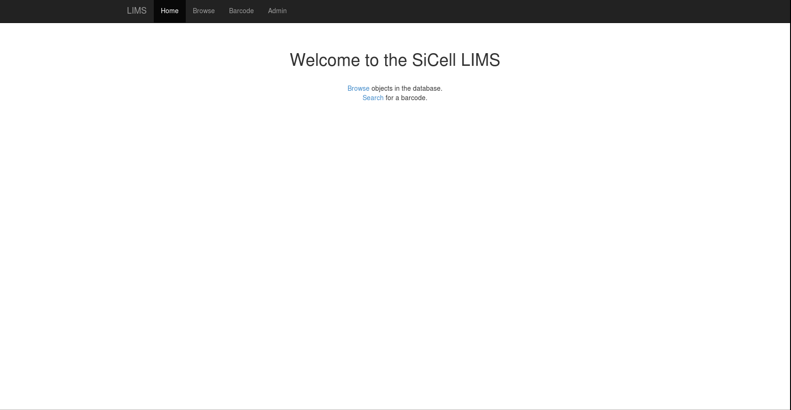

The viewing area currently just gives a simple listing of the different objects
in the database. The main feature of the viewing area is the ability to see a
tree of all related objects with a sample of choice at the root. The listing of
the objects is more limited than the admin area, so for browsing objects in the
database it is still more user-friendly to use the admin area.

Admin area
----------
.. image:: images/screenshot_admin.png

The admin area is where one actually inputs information into the database.
Adding, editing, sorting and listing of objects is possible.

Bulk import
^^^^^^^^^^^
The Container and Sample tables have an option to bulk import multiple objects
in one go with a csv, json or excel file. This is only recommended for advanced
users, because you skip a lot of extra checks done that you would normally have
when you fill in the forms. The importer's error messages can be rather
cryptic. That being said, here is how to do it.

Import a bunch of Samples in one go
"""""""""""""""""""""""""""""""""""

1. Go to the import page and download the csv template

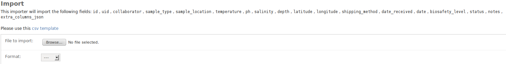

2. Edit the csv template.

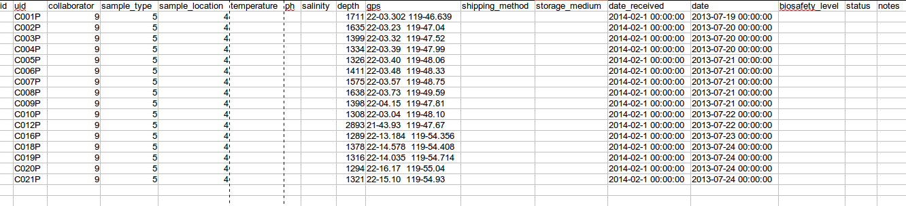
   
The columns that link to other tables should contain the actual id. You can
look them up in their corresponding tables. For instance for the
``sample_type`` you can look at the ``Sample types`` listing:

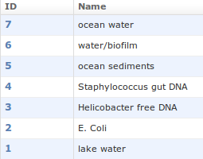

and for ``collaborator`` in the ``Collaborator`` listing:

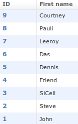

The new ids for the samples don't have to be filled in, since those will be
generated by the system itself.

After the ``extra_columns_json`` you can add as many columns as you like. These
will be stored in the ``extra_columns_json`` field in `JSON format`_ on import.

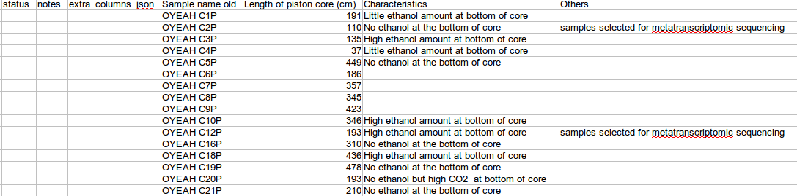

.. _`JSON format`: https://en.wikipedia.org/wiki/Json 

3. Import the edited csv file. Make sure you saved the csv without added
quotation marks around the values. Don't mind the crossed out date part, this
is a known bug in the importer.

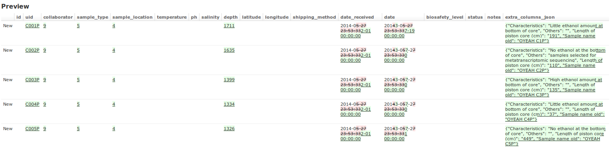

Bulk import a group of wells to store samples in one go
"""""""""""""""""""""""""""""""""""""""""""""""""""""""

1. Create a 384 Well Plate to connect the Wells to using the admin interface

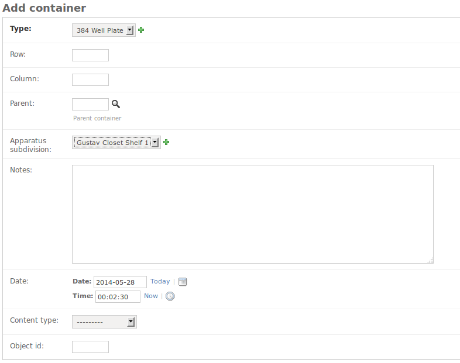

2. Get the id for the new 384 Well Plate (51)

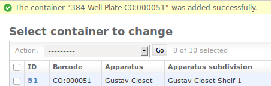

3. Determine the id for the container type you want to add (4)

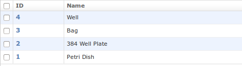

4. Click on import in the Container listing

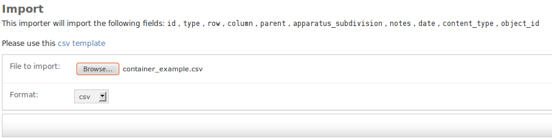

5. Change the given csv template. It uses the id from step 2 as the parent
container and the sample type from step 3. You don't have to specify an id for
the new containers themselves because those will be automatically generated by
the system. The ``content_type`` is an id that refers to the type of object
that is stored, in this case 15 which represents the code for a ``Sample``. It
is not possible yet to get the ids for other content types through the admin or
viewing interface. The ``object_id`` should contain the id of the object, in
this example we used the ones from the previous step.

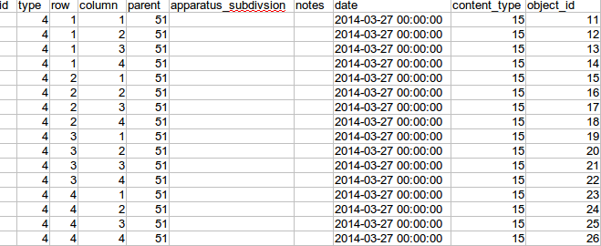

6. Import the csv file.

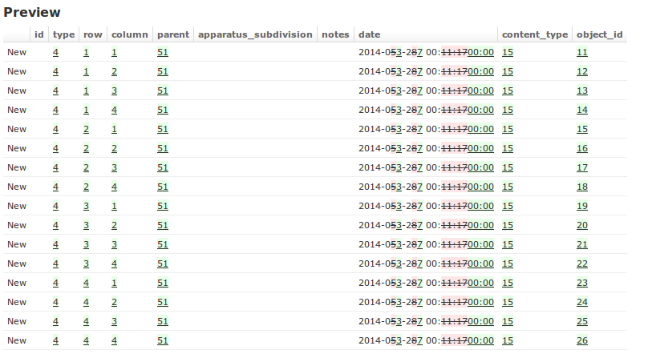

Presentation
------------
There's also a `presentation` of the system available that incorporates several
movies of how to use the system.

.. _`presentation`: http://ino.pm/outreach/presentations/2014/03/lims-presentation/index.html#/

Issues
------
Check out the :doc:`issues` section if you run into errors.
